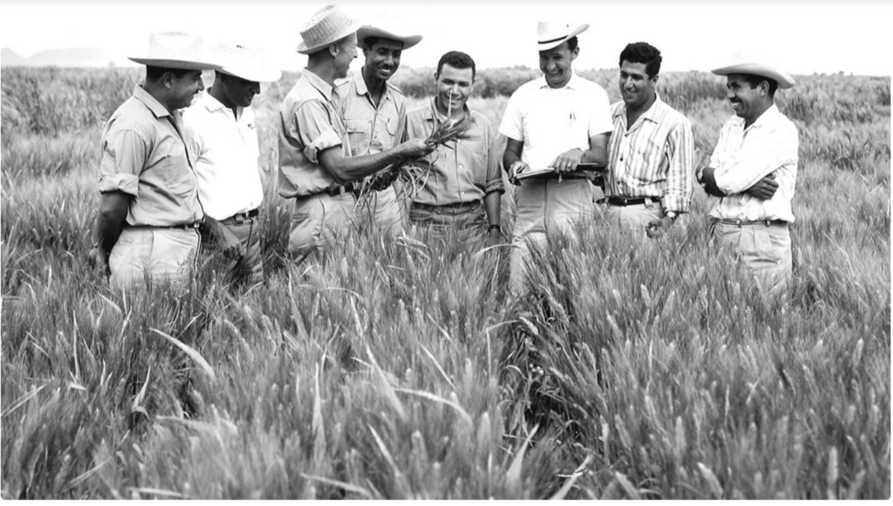

# Tribute Page: [Name of Person Tributed]

A simple, responsive web page built as a tribute page

This project was completed as a requirement for the Norman Borlaug

## Screenshot



## Technologies Used

* HTML:For the structure and semantic organization of the content.
* CSS:For styling, layout, and ensuring the page is responsive across devices.

## Features

* Semantic HTML: Uses modern HTML5 tags like `<header>`, `<main>`, `<nav>`, and `<pre>`.
* Responsive Design: Adapts gracefully to various screen sizes using CSS media queries.
* Clean Styling: Focuses on readability and clear presentation of information.

## Getting Started

You can view the live project hosted on [GitHub Pages]([URL to your live GitHub Pages site]) or run it locally.

To run it locally:

1. Clone the repository:
    ```bash
    git clone github.com
    cd YOUR_REPO_NAME
    ```

2. Open the file:
Simply open the `index.html` file in your preferred web browser.

## License
Thi project is licensed under the [MIT License](opensource.org) - see the [LICENSE](LICENSE) file for details.

## author
* [Your Gennymiriane]** -([URL])

